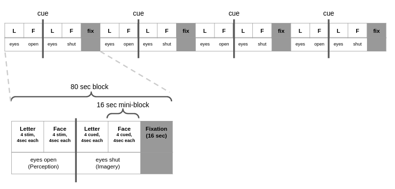

# Visual Imagery Project

To create the conda environment for this project run:
```bash
conda env create -f psychopy.yml
conda activate psychopy
```

## Experimental design


## Script usage
```bash
python experiment.py --filepath /path/to/subjX_runX.csv --stimulus_time 3.0 -delay_time 8.0
python gen_stimuli.py --nBlocks 8 --subjID 1 --runID 1
```

## Day 1 notes
```bash
```
